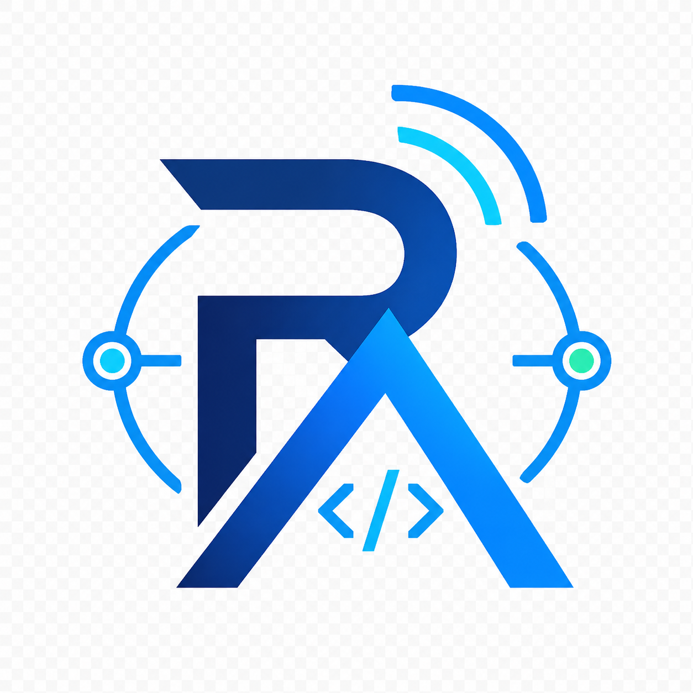

# remote-agent

<p align="center">
  
</p>

<p align="center">
  <a href="https://github.com/d-kimuson/remote-agent/actions/workflows/ci.yaml?branch=main"></a>
  <a href="https://github.com/d-kimuson/remote-agent/releases"></a>
  <a href="https://npmjs.com/package/@kimuson/remote-agent"></a>
  <a href="https://deepwiki.com/d-kimuson/remote-agent"></a>
  <a href="LICENSE"></a>
</p>

> `remote-agent` is a tool for remotely operating coding agents such as Codex, Claude Code, Cursor
> CLI, and other agent CLIs from a single web interface. Run the `remote-agent` server on your own
> machine, then connect from a client device such as iOS, Android, another desktop browser, or an
> installed PWA to start sessions, resume work, approve tool requests, and interact with your
> agents.

## Installation

### Quick Start (PWA with Tailscale, Recommended)

`remote-agent` works best when installed as a PWA from a secure Tailscale URL. PWA installation is
strongly recommended for notifications and the mobile experience.

To install and use the PWA, the client must access `remote-agent` through HTTPS. The recommended
setup is Tailscale MagicDNS with HTTPS certificates:

- https://tailscale.com/docs/how-to/quickstart
- https://tailscale.com/docs/how-to/set-up-https-certificates

Make sure the agent you want to use is already available on the server machine, then start
`remote-agent` with the Tailscale setup helper:

```bash
npx -y @kimuson/remote-agent@latest serve --tailscale 48989
```

This command starts the `remote-agent` SPA/PWA and API server on an available local port, configures
Tailscale Serve for `https://<magic-dns-name>:48989`, then prints the URL and a QR code.

Tailscale Serve may need to update HTTPS certificate settings. If the command asks for your sudo
password, enter it to continue. After setup completes, open the printed URL or scan the QR code from
the client device, then install the PWA from the browser.

## Manual Setup

The `serve` command starts both the client SPA/PWA and the API server:

```bash
npx -y @kimuson/remote-agent@latest serve
```

By default, the server listens on HTTP. If you do not use `--tailscale`, you are responsible for
providing secure communication between the client and the server. This can be a VPN, a reverse
proxy, or a tunnel such as Cloudflare Tunnel in front of the local `remote-agent` server.

Running `remote-agent` on a public hostname is not the recommended default. If you do expose it, set
an API key and only share the URL with trusted users. You can generate an API key with:

```bash
npx -y @kimuson/remote-agent@latest generate-api-key
```

Then pass it to the server:

```bash
RA_API_KEY=<generated-api-key> RA_ALLOWED_IPS=203.0.113.10,198.51.100.20 npx -y @kimuson/remote-agent@latest serve
```

Then clients must send the API key as a bearer token for `/api/*` requests. You can also restrict
accepted client IPs with `RA_ALLOWED_IPS`.

## Features

- 🤖 Multi-provider support: built-in providers for Codex, Claude Code, GitHub Copilot CLI,
  pi-coding-agent, Cursor CLI, and OpenCode. Any ACP-compatible agent can also be added as a custom
  provider.
- 🌐 Browser/PWA client: the client is served as an SPA and works through a browser on any OS.
  Install it as a PWA for an app-like experience.
- ⚡ Real-time preview: stream agent output as it is produced.
- 🛠️ Visual tool viewers: inspect common tool calls such as Bash, Read, Write, and Edit with
  terminal, file, and diff viewers.
- ✅ Tool approval: approve or reject tool-approval requests from supported agents.
- 🔔 Notifications: receive task-completion and approval-request notifications. When installed as a
  PWA, device notifications are available through the service worker.
- 🔊 Completion sound: play an audible notification when an agent task finishes.
- ✍️ Efficient prompt input: use agent command completion, file-path completion, and voice input.
- 🧑‍💻 Code review: open a GitHub-like diff viewer, leave line comments, and seamlessly turn them
  into review instructions for the agent.
- 🌿 Git worktree support: start sessions in a selected worktree. Supports `.worktreeinclude`,
  optional setup scripts, and preserving subpaths when starting from a subdirectory in a monorepo.
- ⏰ Routines: run agents on cron schedules or at a specified datetime.
- 🔐 Authentication: supports API key authentication and IP address restrictions.

## Configuration

`remote-agent` is configured with CLI flags and environment variables.

| Environment variable | CLI flag        | Default | Description                                                                 |
| -------------------- | --------------- | ------- | --------------------------------------------------------------------------- |
| `PORT`               | `--port`        | `8989`  | HTTP port for the `remote-agent` server.                                    |
| `RA_DIR`             | `--ra-dir`      | `~/.ra` | Directory for the SQLite database and app state.                            |
| `RA_API_KEY`         | `--ra-api-key`  | -       | Bearer token required for `/api/*` requests. If unset, API key auth is off. |
| `RA_ALLOWED_IPS`     | `--ra-allowed-ips` | -    | Comma-separated IP allowlist checked via `X-Forwarded-For` / `X-Real-IP`.   |
| `RA_ALLOWED_ORIGINS` | `--ra-allowed-origins` | - | Comma-separated CORS origin allowlist for `/api/*` requests.                |
| -                    | `--server-only` | `false` | Start only the API server without serving the client build.                 |
| -                    | `--tailscale`   | -       | Publish through Tailscale Serve on the given HTTPS port.                    |

When both an environment variable and a CLI flag are provided, the CLI flag takes priority.

## Available Providers

`remote-agent` includes built-in provider presets for these agent CLIs:

| Provider           | Preset ID         | Log import |
| ------------------ | ----------------- | ---------- |
| Codex              | `codex`           | ✅         |
| Claude Code        | `claude-code`     | ✅         |
| GitHub Copilot CLI | `copilot-cli`     | ❌         |
| pi-coding-agent    | `pi-coding-agent` | ✅         |
| Cursor CLI         | `cursor-cli`      | ❌         |
| OpenCode           | `opencode`        | ❌         |

`remote-agent` does not require you to install ACP packages separately. Make sure the agent you want
to use is available on the server machine and authenticated as that agent normally requires.

> [!WARNING]
> Do not use Claude Code through `remote-agent` with a Claude subscription account. `remote-agent`
> only connects to a local CLI process, so it may technically work with subscription-based Claude
> Code authentication. However, Claude Code ACP is implemented through Agent SDK, and Anthropic does
> not allow Claude Code subscription access to be used from third-party tools. Use provider
> authentication only when it is permitted by the provider's current terms.

### Custom Provider

Want to use another agent? Add it as a Custom Provider through ACP.

See the ACP agent list at https://agentclientprotocol.com/get-started/agents to find an available
agent. If the agent you want is not listed, implement an ACP-compatible agent server and register
its command as a Custom Provider.

## Contribute

Contributions are welcome. See [CONTRIBUTING.md](./CONTRIBUTING.md) for development setup, common
commands, generated files, and release checks.

## License

MIT License. See [LICENSE](./LICENSE).
