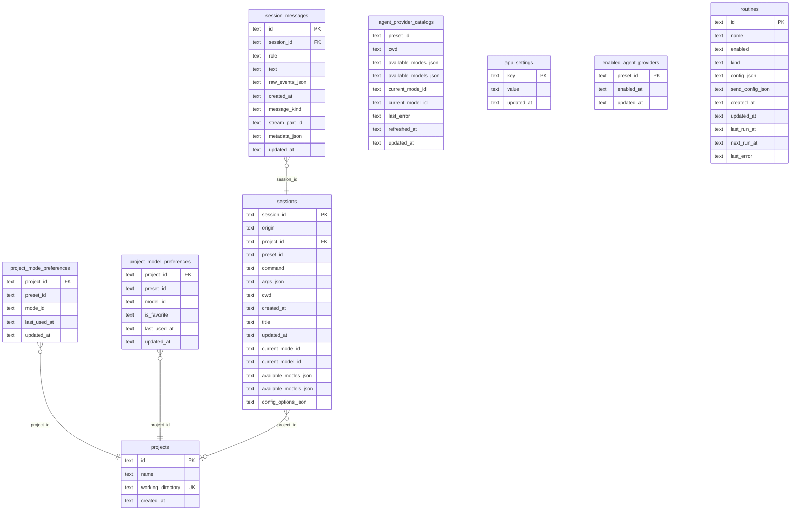
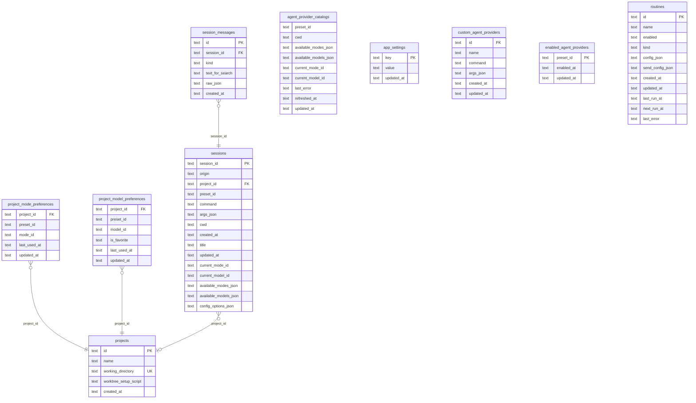

# Tables

| Name                                                    | Columns | Comment |
| ------------------------------------------------------- | ------- | ------- |
| [agent_provider_catalogs](#agent_provider_catalogs)     | 9       |         |
| [app_settings](#app_settings)                           | 3       |         |
| [enabled_agent_providers](#enabled_agent_providers)     | 3       |         |
| [project_mode_preferences](#project_mode_preferences)   | 5       |         |
| [project_model_preferences](#project_model_preferences) | 6       |         |
| [projects](#projects)                                   | 4       |         |
| [routines](#routines)                                   | 11      |         |
| [session_messages](#session_messages)                   | 10      |         |
| [sessions](#sessions)                                   | 15      |         |

---

## agent_provider_catalogs

### Columns

| Name                  | Type | Default | Nullable | Children | Parents | Comment |
| --------------------- | ---- | ------- | -------- | -------- | ------- | ------- |
| preset_id             | text | -       | NO       | -        | -       | -       |
| cwd                   | text | -       | NO       | -        | -       | -       |
| available_modes_json  | text | -       | NO       | -        | -       | -       |
| available_models_json | text | -       | NO       | -        | -       | -       |
| current_mode_id       | text | -       | YES      | -        | -       | -       |
| current_model_id      | text | -       | YES      | -        | -       | -       |
| last_error            | text | -       | YES      | -        | -       | -       |
| refreshed_at          | text | -       | NO       | -        | -       | -       |
| updated_at            | text | -       | NO       | -        | -       | -       |

### Constraints

| Name             | Type        | Definition       |
| ---------------- | ----------- | ---------------- |
| pk_preset_id_cwd | PRIMARY KEY | (preset_id, cwd) |

### Indexes

| Name                                   | Columns    | Unique | Type |
| -------------------------------------- | ---------- | ------ | ---- |
| idx_agent_provider_catalogs_preset_id  | preset_id  | NO     | -    |
| idx_agent_provider_catalogs_updated_at | updated_at | NO     | -    |

---

## app_settings

### Columns

| Name       | Type | Default | Nullable | Children | Parents | Comment |
| ---------- | ---- | ------- | -------- | -------- | ------- | ------- |
| **key**    | text | -       | NO       | -        | -       | -       |
| value      | text | -       | NO       | -        | -       | -       |
| updated_at | text | -       | NO       | -        | -       | -       |

---

## enabled_agent_providers

### Columns

| Name          | Type | Default | Nullable | Children | Parents | Comment |
| ------------- | ---- | ------- | -------- | -------- | ------- | ------- |
| **preset_id** | text | -       | NO       | -        | -       | -       |
| enabled_at    | text | -       | NO       | -        | -       | -       |
| updated_at    | text | -       | NO       | -        | -       | -       |

### Indexes

| Name                                   | Columns    | Unique | Type |
| -------------------------------------- | ---------- | ------ | ---- |
| idx_enabled_agent_providers_updated_at | updated_at | NO     | -    |

---

## project_mode_preferences

### Columns

| Name         | Type | Default | Nullable | Children | Parents                  | Comment |
| ------------ | ---- | ------- | -------- | -------- | ------------------------ | ------- |
| project_id   | text | -       | NO       | -        | [projects.id](#projects) | -       |
| preset_id    | text | -       | NO       | -        | -                        | -       |
| mode_id      | text | -       | NO       | -        | -                        | -       |
| last_used_at | text | -       | YES      | -        | -                        | -       |
| updated_at   | text | -       | NO       | -        | -                        | -       |

### Constraints

| Name                            | Type        | Definition                       |
| ------------------------------- | ----------- | -------------------------------- |
| pk_project_id_preset_id_mode_id | PRIMARY KEY | (project_id, preset_id, mode_id) |
| fk_project_id_projects          | FOREIGN KEY | (project_id) → projects(id)      |

### Indexes

| Name                                        | Columns               | Unique | Type |
| ------------------------------------------- | --------------------- | ------ | ---- |
| idx_project_mode_preferences_project_preset | project_id, preset_id | NO     | -    |
| idx_project_mode_preferences_last_used      | last_used_at          | NO     | -    |

### Relations

| Parent                   | Child                                                                | Type        |
| ------------------------ | -------------------------------------------------------------------- | ----------- |
| [projects.id](#projects) | **[project_mode_preferences.project_id](#project_mode_preferences)** | Many to One |

---

## project_model_preferences

### Columns

| Name         | Type | Default   | Nullable | Children | Parents                  | Comment |
| ------------ | ---- | --------- | -------- | -------- | ------------------------ | ------- |
| project_id   | text | -         | NO       | -        | [projects.id](#projects) | -       |
| preset_id    | text | -         | NO       | -        | -                        | -       |
| model_id     | text | -         | NO       | -        | -                        | -       |
| is_favorite  | text | `'false'` | NO       | -        | -                        | -       |
| last_used_at | text | -         | YES      | -        | -                        | -       |
| updated_at   | text | -         | NO       | -        | -                        | -       |

### Constraints

| Name                             | Type        | Definition                        |
| -------------------------------- | ----------- | --------------------------------- |
| pk_project_id_preset_id_model_id | PRIMARY KEY | (project_id, preset_id, model_id) |
| fk_project_id_projects           | FOREIGN KEY | (project_id) → projects(id)       |

### Indexes

| Name                                         | Columns               | Unique | Type |
| -------------------------------------------- | --------------------- | ------ | ---- |
| idx_project_model_preferences_project_preset | project_id, preset_id | NO     | -    |
| idx_project_model_preferences_last_used      | last_used_at          | NO     | -    |

### Relations

| Parent                   | Child                                                                  | Type        |
| ------------------------ | ---------------------------------------------------------------------- | ----------- |
| [projects.id](#projects) | **[project_model_preferences.project_id](#project_model_preferences)** | Many to One |

---

## projects

### Columns

| Name              | Type | Default | Nullable | Children                                                                                                                                                               | Parents | Comment |
| ----------------- | ---- | ------- | -------- | ---------------------------------------------------------------------------------------------------------------------------------------------------------------------- | ------- | ------- |
| **id**            | text | -       | NO       | [project_mode_preferences.project_id](#project_mode_preferences), [project_model_preferences.project_id](#project_model_preferences), [sessions.project_id](#sessions) | -       | -       |
| name              | text | -       | NO       | -                                                                                                                                                                      | -       | -       |
| working_directory | text | -       | NO       | -                                                                                                                                                                      | -       | -       |
| created_at        | text | -       | NO       | -                                                                                                                                                                      | -       | -       |

### Indexes

| Name                    | Columns    | Unique | Type |
| ----------------------- | ---------- | ------ | ---- |
| idx_projects_created_at | created_at | NO     | -    |

### Relations

| Parent                       | Child                                                              | Type        |
| ---------------------------- | ------------------------------------------------------------------ | ----------- |
| **[projects.id](#projects)** | [project_mode_preferences.project_id](#project_mode_preferences)   | Many to One |
| **[projects.id](#projects)** | [project_model_preferences.project_id](#project_model_preferences) | Many to One |
| **[projects.id](#projects)** | [sessions.project_id](#sessions)                                   | Many to One |

---

## routines

### Columns

| Name             | Type | Default | Nullable | Children | Parents | Comment |
| ---------------- | ---- | ------- | -------- | -------- | ------- | ------- |
| **id**           | text | -       | NO       | -        | -       | -       |
| name             | text | -       | NO       | -        | -       | -       |
| enabled          | text | -       | NO       | -        | -       | -       |
| kind             | text | -       | NO       | -        | -       | -       |
| config_json      | text | -       | NO       | -        | -       | -       |
| send_config_json | text | -       | NO       | -        | -       | -       |
| created_at       | text | -       | NO       | -        | -       | -       |
| updated_at       | text | -       | NO       | -        | -       | -       |
| last_run_at      | text | -       | YES      | -        | -       | -       |
| next_run_at      | text | -       | YES      | -        | -       | -       |
| last_error       | text | -       | YES      | -        | -       | -       |

### Indexes

| Name                             | Columns              | Unique | Type |
| -------------------------------- | -------------------- | ------ | ---- |
| idx_routines_enabled_next_run_at | enabled, next_run_at | NO     | -    |
| idx_routines_updated_at          | updated_at           | NO     | -    |

---

## session_messages

### Columns

| Name            | Type | Default                   | Nullable | Children | Parents                          | Comment |
| --------------- | ---- | ------------------------- | -------- | -------- | -------------------------------- | ------- |
| **id**          | text | -                         | NO       | -        | -                                | -       |
| session_id      | text | -                         | NO       | -        | [sessions.session_id](#sessions) | -       |
| role            | text | -                         | NO       | -        | -                                | -       |
| text            | text | -                         | NO       | -        | -                                | -       |
| raw_events_json | text | -                         | NO       | -        | -                                | -       |
| created_at      | text | -                         | NO       | -        | -                                | -       |
| message_kind    | text | `'legacy_assistant_turn'` | NO       | -        | -                                | -       |
| stream_part_id  | text | -                         | YES      | -        | -                                | -       |
| metadata_json   | text | `'{}'`                    | NO       | -        | -                                | -       |
| updated_at      | text | -                         | NO       | -        | -                                | -       |

### Constraints

| Name                   | Type        | Definition                          |
| ---------------------- | ----------- | ----------------------------------- |
| fk_session_id_sessions | FOREIGN KEY | (session_id) → sessions(session_id) |

### Indexes

| Name                             | Columns                    | Unique | Type |
| -------------------------------- | -------------------------- | ------ | ---- |
| idx_session_messages_session_id  | session_id                 | NO     | -    |
| idx_session_messages_created_at  | created_at                 | NO     | -    |
| idx_session_messages_stream_part | session_id, stream_part_id | YES    | -    |

### Relations

| Parent                           | Child                                                | Type        |
| -------------------------------- | ---------------------------------------------------- | ----------- |
| [sessions.session_id](#sessions) | **[session_messages.session_id](#session_messages)** | Many to One |

---

## sessions

### Columns

| Name                  | Type | Default | Nullable | Children                                         | Parents                  | Comment |
| --------------------- | ---- | ------- | -------- | ------------------------------------------------ | ------------------------ | ------- |
| **session_id**        | text | -       | NO       | [session_messages.session_id](#session_messages) | -                        | -       |
| origin                | text | -       | NO       | -                                                | -                        | -       |
| project_id            | text | -       | YES      | -                                                | [projects.id](#projects) | -       |
| preset_id             | text | -       | YES      | -                                                | -                        | -       |
| command               | text | -       | NO       | -                                                | -                        | -       |
| args_json             | text | -       | NO       | -                                                | -                        | -       |
| cwd                   | text | -       | NO       | -                                                | -                        | -       |
| created_at            | text | -       | NO       | -                                                | -                        | -       |
| title                 | text | -       | YES      | -                                                | -                        | -       |
| updated_at            | text | -       | YES      | -                                                | -                        | -       |
| current_mode_id       | text | -       | YES      | -                                                | -                        | -       |
| current_model_id      | text | -       | YES      | -                                                | -                        | -       |
| available_modes_json  | text | -       | NO       | -                                                | -                        | -       |
| available_models_json | text | -       | NO       | -                                                | -                        | -       |
| config_options_json   | text | `'[]'`  | NO       | -                                                | -                        | -       |

### Constraints

| Name                   | Type        | Definition                  |
| ---------------------- | ----------- | --------------------------- |
| fk_project_id_projects | FOREIGN KEY | (project_id) → projects(id) |

### Indexes

| Name                    | Columns    | Unique | Type |
| ----------------------- | ---------- | ------ | ---- |
| idx_sessions_created_at | created_at | NO     | -    |
| idx_sessions_project_id | project_id | NO     | -    |

### Relations

| Parent                               | Child                                            | Type        |
| ------------------------------------ | ------------------------------------------------ | ----------- |
| **[sessions.session_id](#sessions)** | [session_messages.session_id](#session_messages) | Many to One |
| [projects.id](#projects)             | **[sessions.project_id](#sessions)**             | Many to One |

---

## ER Diagram

# Tables

| Name | Columns | Comment |
|------|---------|---------|
| [agent_provider_catalogs](#agent_provider_catalogs) | 9 |  |
| [app_settings](#app_settings) | 3 |  |
| [custom_agent_providers](#custom_agent_providers) | 6 |  |
| [enabled_agent_providers](#enabled_agent_providers) | 3 |  |
| [project_mode_preferences](#project_mode_preferences) | 5 |  |
| [project_model_preferences](#project_model_preferences) | 6 |  |
| [projects](#projects) | 5 |  |
| [routines](#routines) | 11 |  |
| [session_messages](#session_messages) | 6 |  |
| [sessions](#sessions) | 15 |  |

---

## agent_provider_catalogs

### Columns

| Name | Type | Default | Nullable | Children | Parents | Comment |
|------|------|---------|----------|----------|---------|---------|
| preset_id | text | - | NO | - | - | - |
| cwd | text | - | NO | - | - | - |
| available_modes_json | text | - | NO | - | - | - |
| available_models_json | text | - | NO | - | - | - |
| current_mode_id | text | - | YES | - | - | - |
| current_model_id | text | - | YES | - | - | - |
| last_error | text | - | YES | - | - | - |
| refreshed_at | text | - | NO | - | - | - |
| updated_at | text | - | NO | - | - | - |

### Constraints

| Name | Type | Definition |
|------|------|------------|
| pk_preset_id_cwd | PRIMARY KEY | (preset_id, cwd) |

### Indexes

| Name | Columns | Unique | Type |
|------|---------|--------|------|
| idx_agent_provider_catalogs_preset_id | preset_id | NO | - |
| idx_agent_provider_catalogs_updated_at | updated_at | NO | - |

---

## app_settings

### Columns

| Name | Type | Default | Nullable | Children | Parents | Comment |
|------|------|---------|----------|----------|---------|---------|
| **key** | text | - | NO | - | - | - |
| value | text | - | NO | - | - | - |
| updated_at | text | - | NO | - | - | - |

---

## custom_agent_providers

### Columns

| Name | Type | Default | Nullable | Children | Parents | Comment |
|------|------|---------|----------|----------|---------|---------|
| **id** | text | - | NO | - | - | - |
| name | text | - | NO | - | - | - |
| command | text | - | NO | - | - | - |
| args_json | text | - | NO | - | - | - |
| created_at | text | - | NO | - | - | - |
| updated_at | text | - | NO | - | - | - |

### Indexes

| Name | Columns | Unique | Type |
|------|---------|--------|------|
| idx_custom_agent_providers_name | name | YES | - |
| idx_custom_agent_providers_updated_at | updated_at | NO | - |

---

## enabled_agent_providers

### Columns

| Name | Type | Default | Nullable | Children | Parents | Comment |
|------|------|---------|----------|----------|---------|---------|
| **preset_id** | text | - | NO | - | - | - |
| enabled_at | text | - | NO | - | - | - |
| updated_at | text | - | NO | - | - | - |

### Indexes

| Name | Columns | Unique | Type |
|------|---------|--------|------|
| idx_enabled_agent_providers_updated_at | updated_at | NO | - |

---

## project_mode_preferences

### Columns

| Name | Type | Default | Nullable | Children | Parents | Comment |
|------|------|---------|----------|----------|---------|---------|
| project_id | text | - | NO | - | [projects.id](#projects) | - |
| preset_id | text | - | NO | - | - | - |
| mode_id | text | - | NO | - | - | - |
| last_used_at | text | - | YES | - | - | - |
| updated_at | text | - | NO | - | - | - |

### Constraints

| Name | Type | Definition |
|------|------|------------|
| pk_project_id_preset_id_mode_id | PRIMARY KEY | (project_id, preset_id, mode_id) |
| fk_project_id_projects | FOREIGN KEY | (project_id) → projects(id) |

### Indexes

| Name | Columns | Unique | Type |
|------|---------|--------|------|
| idx_project_mode_preferences_project_preset | project_id, preset_id | NO | - |
| idx_project_mode_preferences_last_used | last_used_at | NO | - |

### Relations

| Parent | Child | Type |
|--------|-------|------|
| [projects.id](#projects) | **[project_mode_preferences.project_id](#project_mode_preferences)** | Many to One |

---

## project_model_preferences

### Columns

| Name | Type | Default | Nullable | Children | Parents | Comment |
|------|------|---------|----------|----------|---------|---------|
| project_id | text | - | NO | - | [projects.id](#projects) | - |
| preset_id | text | - | NO | - | - | - |
| model_id | text | - | NO | - | - | - |
| is_favorite | text | `'false'` | NO | - | - | - |
| last_used_at | text | - | YES | - | - | - |
| updated_at | text | - | NO | - | - | - |

### Constraints

| Name | Type | Definition |
|------|------|------------|
| pk_project_id_preset_id_model_id | PRIMARY KEY | (project_id, preset_id, model_id) |
| fk_project_id_projects | FOREIGN KEY | (project_id) → projects(id) |

### Indexes

| Name | Columns | Unique | Type |
|------|---------|--------|------|
| idx_project_model_preferences_project_preset | project_id, preset_id | NO | - |
| idx_project_model_preferences_last_used | last_used_at | NO | - |

### Relations

| Parent | Child | Type |
|--------|-------|------|
| [projects.id](#projects) | **[project_model_preferences.project_id](#project_model_preferences)** | Many to One |

---

## projects

### Columns

| Name | Type | Default | Nullable | Children | Parents | Comment |
|------|------|---------|----------|----------|---------|---------|
| **id** | text | - | NO | [project_mode_preferences.project_id](#project_mode_preferences), [project_model_preferences.project_id](#project_model_preferences), [sessions.project_id](#sessions) | - | - |
| name | text | - | NO | - | - | - |
| working_directory | text | - | NO | - | - | - |
| worktree_setup_script | text | `''` | NO | - | - | - |
| created_at | text | - | NO | - | - | - |

### Indexes

| Name | Columns | Unique | Type |
|------|---------|--------|------|
| idx_projects_created_at | created_at | NO | - |

### Relations

| Parent | Child | Type |
|--------|-------|------|
| **[projects.id](#projects)** | [project_mode_preferences.project_id](#project_mode_preferences) | Many to One |
| **[projects.id](#projects)** | [project_model_preferences.project_id](#project_model_preferences) | Many to One |
| **[projects.id](#projects)** | [sessions.project_id](#sessions) | Many to One |

---

## routines

### Columns

| Name | Type | Default | Nullable | Children | Parents | Comment |
|------|------|---------|----------|----------|---------|---------|
| **id** | text | - | NO | - | - | - |
| name | text | - | NO | - | - | - |
| enabled | text | - | NO | - | - | - |
| kind | text | - | NO | - | - | - |
| config_json | text | - | NO | - | - | - |
| send_config_json | text | - | NO | - | - | - |
| created_at | text | - | NO | - | - | - |
| updated_at | text | - | NO | - | - | - |
| last_run_at | text | - | YES | - | - | - |
| next_run_at | text | - | YES | - | - | - |
| last_error | text | - | YES | - | - | - |

### Indexes

| Name | Columns | Unique | Type |
|------|---------|--------|------|
| idx_routines_enabled_next_run_at | enabled, next_run_at | NO | - |
| idx_routines_updated_at | updated_at | NO | - |

---

## session_messages

### Columns

| Name | Type | Default | Nullable | Children | Parents | Comment |
|------|------|---------|----------|----------|---------|---------|
| **id** | text | - | NO | - | - | - |
| session_id | text | - | NO | - | [sessions.session_id](#sessions) | - |
| kind | text | - | NO | - | - | - |
| text_for_search | text | `''` | NO | - | - | - |
| raw_json | text | - | NO | - | - | - |
| created_at | text | - | NO | - | - | - |

### Constraints

| Name | Type | Definition |
|------|------|------------|
| fk_session_id_sessions | FOREIGN KEY | (session_id) → sessions(session_id) |

### Indexes

| Name | Columns | Unique | Type |
|------|---------|--------|------|
| idx_session_messages_session_created | session_id, created_at | NO | - |
| idx_session_messages_session_kind | session_id, kind | NO | - |

### Relations

| Parent | Child | Type |
|--------|-------|------|
| [sessions.session_id](#sessions) | **[session_messages.session_id](#session_messages)** | Many to One |

---

## sessions

### Columns

| Name | Type | Default | Nullable | Children | Parents | Comment |
|------|------|---------|----------|----------|---------|---------|
| **session_id** | text | - | NO | [session_messages.session_id](#session_messages) | - | - |
| origin | text | - | NO | - | - | - |
| project_id | text | - | YES | - | [projects.id](#projects) | - |
| preset_id | text | - | YES | - | - | - |
| command | text | - | NO | - | - | - |
| args_json | text | - | NO | - | - | - |
| cwd | text | - | NO | - | - | - |
| created_at | text | - | NO | - | - | - |
| title | text | - | YES | - | - | - |
| updated_at | text | - | YES | - | - | - |
| current_mode_id | text | - | YES | - | - | - |
| current_model_id | text | - | YES | - | - | - |
| available_modes_json | text | - | NO | - | - | - |
| available_models_json | text | - | NO | - | - | - |
| config_options_json | text | `'[]'` | NO | - | - | - |

### Constraints

| Name | Type | Definition |
|------|------|------------|
| fk_project_id_projects | FOREIGN KEY | (project_id) → projects(id) |

### Indexes

| Name | Columns | Unique | Type |
|------|---------|--------|------|
| idx_sessions_created_at | created_at | NO | - |
| idx_sessions_project_id | project_id | NO | - |

### Relations

| Parent | Child | Type |
|--------|-------|------|
| **[sessions.session_id](#sessions)** | [session_messages.session_id](#session_messages) | Many to One |
| [projects.id](#projects) | **[sessions.project_id](#sessions)** | Many to One |

---

## ER Diagram

